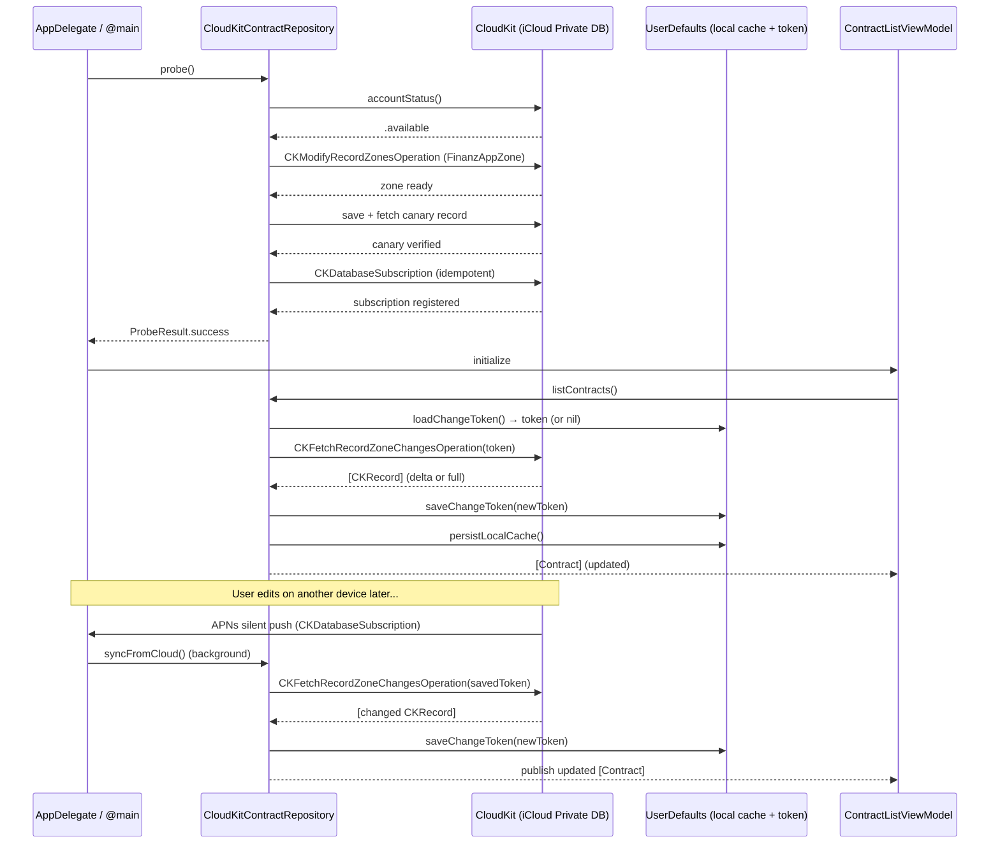

# ADR-003: CloudKit Sync Strategy

**Status:** Accepted  
**Date:** 2026-06-26  
**Deciders:** Fabian Benusch (sole developer)  
**Context:** FinanzApp SwiftUI rewrite — sync and error handling for `CloudKitContractRepository`  
**Depends on:** ADR-002 (CloudKit Data Model)

---

## Context

`CloudKitContractRepository` is the sole implementation of the `ContractRepository` protocol. It must:
1. Load all contracts on app launch with minimal latency — the user should see their portfolio immediately.
2. Keep data fresh when records change on another device (multi-device sync).
3. Handle a well-documented set of `CKError` codes without crashing or losing data.
4. Verify its own substrate (CloudKit / iCloud availability) before accepting any user-facing save operations.

This ADR specifies the fetch strategy, push notification subscription, conflict resolution, token management, and the full `CKError` handling matrix.

---

## Decision

### 1. Fetch Strategy: Delta Sync with Server Change Token

**Mechanism:** `CKFetchRecordZoneChangesOperation` on `FinanzAppZone`.

On every fetch, `CloudKitContractRepository` passes the last saved `serverChangeToken`. CloudKit returns only records that changed since that token was issued. On success, the new token is saved and the local cache is updated.

**Token storage:** `UserDefaults`, key `"FinanzApp.serverChangeToken"`, encoded as `Data` via `NSKeyedArchiver`. One token per device (tokens are device-scoped by CloudKit).

```swift
// Store token
func saveChangeToken(_ token: CKServerChangeToken) {
    let data = try? NSKeyedArchiver.archivedData(
        withRootObject: token, requiringSecureCoding: true
    )
    UserDefaults.standard.set(data, forKey: "FinanzApp.serverChangeToken")
}

// Load token (nil on first launch → full fetch)
func loadChangeToken() -> CKServerChangeToken? {
    guard let data = UserDefaults.standard.data(
        forKey: "FinanzApp.serverChangeToken"
    ) else { return nil }
    return try? NSKeyedUnarchiver.unarchivedObject(
        ofClass: CKServerChangeToken.self, from: data
    )
}
```

**First launch (nil token):** CloudKit returns all records in the zone. This is the full sync baseline.

**Subsequent launches (token present):** CloudKit returns only the delta. For a portfolio of 10–30 contracts with low change frequency (once per day per device), typical delta = 0–3 records. Fetch latency: ~200–500 ms on a good connection.

**Fetch flow:**

```
App launch
    ↓
CloudKitContractRepository.probe()   ← MUST succeed before any fetch
    ↓
listContracts() called by ContractListViewModel
    ↓
CKFetchRecordZoneChangesOperation(
    zoneIDs: [FinanzAppZone.zoneID],
    configurationsByRecordZoneID: [zoneID: config(previousServerChangeToken: token)]
)
    ↓
recordWasChangedBlock: decode CKRecord → Contract/PendingContract, upsert local cache
recordWithIDWasDeletedBlock: remove from local cache by recordName (UUID string)
    ↓
recordZoneFetchResultBlock:
    .success(serverChangeToken, _, _):
        saveChangeToken(newToken)
        publish updated [Contract] to @Observable state
    .failure(let error):
        handle per error matrix (section 4)
```

**Pagination:** `CKFetchRecordZoneChangesOperation` paginates automatically using `moreComing`. The operation calls `recordZoneFetchResultBlock` with `moreComing: true` until all records are delivered. No manual pagination cursor handling is required.

**Results limit:** Not applicable to `CKFetchRecordZoneChangesOperation` (unlike `CKQueryOperation`). All zone changes since the token are returned.

**Local cache:** In-memory `[UUID: Contract]` and `[UUID: PendingContract]` dictionaries on `CloudKitContractRepository`. Persisted to `UserDefaults` as JSON blobs (keyed `"FinanzApp.localContractCache"`) for offline access. Cache is written after every successful CloudKit operation.

```swift
// Cache write after each successful fetch or save
func persistLocalCache() throws {
    let encoder = JSONEncoder()
    encoder.dateEncodingStrategy = .iso8601
    let contractData    = try encoder.encode(Array(contractCache.values))
    let pendingData     = try encoder.encode(Array(pendingCache.values))
    UserDefaults.standard.set(contractData, forKey: "FinanzApp.localContractCache")
    UserDefaults.standard.set(pendingData,  forKey: "FinanzApp.localPendingCache")
}
```

**Offline read:** When `CKFetchRecordZoneChangesOperation` fails with a network error, `listContracts()` returns the `UserDefaults`-cached contracts. `ContractListViewModel` shows an `offlineBanner: Bool` indicator.

---

### 2. Background Sync: CKDatabaseSubscription

**Mechanism:** `CKDatabaseSubscription` (private database subscription) fires an APNs push notification when any record in the private database changes. The notification payload is silent (background push) — no user-visible alert.

**Why database subscription, not zone subscription:** `CKRecordZoneSubscription` requires specifying a record type filter. `CKDatabaseSubscription` covers all record types in the private database with one subscription, which is sufficient for this app (all record types are in one zone).

**Subscription setup (idempotent, called in `probe()`):**

```swift
func setupSubscription() async throws {
    let subscriptionID = "FinanzApp-privateDB-changes"
    let subscription = CKDatabaseSubscription(subscriptionID: subscriptionID)
    let notificationInfo = CKSubscription.NotificationInfo()
    notificationInfo.shouldSendContentAvailable = true  // silent push
    subscription.notificationInfo = notificationInfo

    let op = CKModifySubscriptionsOperation(
        subscriptionsToSave: [subscription],
        subscriptionIDsToDelete: nil
    )
    op.modifySubscriptionsResultBlock = { result in
        // .failure(.serverRejectedRequest) if subscription already exists → ignore
        // .failure(.unknownItem) → retry once, then log
    }
    CKContainer.default().privateCloudDatabase.add(op)
}
```

**Push receipt → fetch:**

```swift
// AppDelegate or SwiftUI .onReceive(NotificationCenter...)
func application(_ application: UIApplication,
                 didReceiveRemoteNotification userInfo: [AnyHashable: Any],
                 fetchCompletionHandler completionHandler: @escaping (UIBackgroundFetchResult) -> Void) {
    let notification = CKNotification(fromRemoteNotificationDictionary: userInfo)
    guard notification?.subscriptionID == "FinanzApp-privateDB-changes" else {
        completionHandler(.noData)
        return
    }
    Task {
        do {
            try await contractRepository.syncFromCloud()   // delta fetch
            completionHandler(.newData)
        } catch {
            completionHandler(.failed)
        }
    }
}
```

**Background App Refresh:** In addition to push-driven sync, `CloudKitContractRepository.syncFromCloud()` is also invoked in `UIApplication.performFetchWithCompletionHandler` (Background App Refresh) as a fallback when APNs delivery is delayed.

**Required Info.plist keys:**
```xml
<key>UIBackgroundModes</key>
<array>
    <string>remote-notification</string>
    <string>fetch</string>
</array>
```

---

### 3. Save Flow

All saves go through `CKModifyRecordsOperation` with `savePolicy: .changedKeys`.

**Why `.changedKeys` not `.allKeys`:** `.changedKeys` sends only modified fields to CloudKit, reducing bandwidth and minimizing merge surface in the rare case of concurrent edits. `.allKeys` would overwrite server fields with stale local values on conflict.

**Save (new or updated Contract):**

```swift
func save(_ contract: Contract) async throws {
    let record = try CKRecord(contract: contract, zoneID: zoneID)
    let op = CKModifyRecordsOperation(recordsToSave: [record], recordIDsToDelete: nil)
    op.savePolicy = .changedKeys
    op.perRecordSaveBlock = { recordID, result in
        switch result {
        case .success(let savedRecord):
            // Update local cache with server-returned record (has updated modificationDate)
            self.contractCache[contract.id] = try? Contract(record: savedRecord)
        case .failure(let error):
            // Per-record error — handle per error matrix
        }
    }
    op.modifyRecordsResultBlock = { result in
        // Batch-level success/failure
    }
    CKContainer.default().privateCloudDatabase.add(op)
    try await withCheckedThrowingContinuation { ... }
}
```

**Confirm flow (PendingContract → Contract, atomic):**

```swift
func confirm(_ pending: PendingContract, corrected: ContractFields?) async throws {
    let contract = Contract(from: pending, correctedFields: corrected)
    let contractRecord   = try CKRecord(contract: contract, zoneID: zoneID)
    let pendingRecordID  = CKRecord.ID(recordName: pending.id.uuidString, zoneID: zoneID)

    // Single operation: delete pending + save contract
    let op = CKModifyRecordsOperation(
        recordsToSave: [contractRecord],
        recordIDsToDelete: [pendingRecordID]
    )
    op.savePolicy = .changedKeys
    // ... result handling
    CKContainer.default().privateCloudDatabase.add(op)
}
```

The combined delete+save in one `CKModifyRecordsOperation` on a custom zone is atomic. If the operation fails, neither deletion nor creation persists.

---

### 4. CKError Handling Matrix

`CloudKitContractRepository` wraps all CloudKit operations. The following table specifies the exact handling per `CKError.Code`. The crafter implements this as a `handleCKError(_ error: CKError, operation: CKOperation) -> CKErrorDisposition` switch.

| `CKError.Code` | Description | Repository Action | User-Visible Effect |
|---|---|---|---|
| `.networkUnavailable` | No internet connection. | Return cached `UserDefaults` contracts. Set `isOffline = true`. Schedule retry when `NWPathMonitor` signals `.satisfied`. | Offline banner in `ContractListView`. No error dialog. |
| `.networkFailure` | Intermittent network error. | Exponential backoff retry: 2s, 4s, 8s (max 3 attempts). If all fail → treat as `.networkUnavailable`. | Offline banner after 3 failures. |
| `.serviceUnavailable` | CloudKit servers temporarily unavailable. | Exponential backoff retry: 5s, 30s, 120s. Use `Retry-After` value from `userInfo[CKErrorRetryAfterKey]` if present — prefer server hint. | No immediate UI effect. If persists > 2 min → show "iCloud unavailable" banner. |
| `.requestRateLimited` | Too many requests. | Wait for `userInfo[CKErrorRetryAfterKey]` duration (CloudKit provides this). Do not retry before that interval. Queue pending saves locally, drain on resume. | No user-visible effect for reads. Save-in-progress spinner persists until drain. |
| `.changeTokenExpired` | Saved `serverChangeToken` is stale (zone reset or long offline period). | Delete saved token from `UserDefaults`. Re-run full fetch (nil token). Clear in-memory cache before refetch to avoid stale data. | Transparent to user — the full sync is slightly slower than a delta sync. |
| `.userDeletedZone` | User deleted iCloud data for this app in Settings → iCloud. | Recreate `FinanzAppZone` via `CKModifyRecordZonesOperation`. Re-upload all locally-cached contracts. Reset `serverChangeToken`. | Show "Syncing contracts to iCloud" progress indicator during re-upload. |
| `.zoneNotFound` | Zone was deleted (same as `.userDeletedZone` but during an operation, not probe). | Same handling as `.userDeletedZone`. Recreate zone, re-upload. | Same as above. |
| `.unknownItem` | Record does not exist (on fetch by ID or delete of already-deleted record). | For fetch: treat as absent (remove from local cache if present). For delete: treat as success (idempotent). | No user-visible effect. |
| `.serverRecordChanged` | Server copy is newer than the client copy being saved (concurrent edit from another device). | Fetch the server record. Compare `modificationDate`. If server is newer: use server copy as the truth. If client has fields not on the server record: merge field-by-field (last-write-wins per field using `modificationDate`). Save merged result. | If same-field conflict detected: surface `ConflictResolutionView` with "device version" vs "iCloud version" side-by-side. User picks winner. This is a rare edge case (same field edited on two devices simultaneously). |
| `.quotaExceeded` | User's iCloud storage is full. | Do not retry. Surface structured error to user. | Full-screen `QuotaExceededView`: "Your iCloud storage is full. Please free up space in Settings → iCloud → Manage Storage." No silent failure. |
| `.notAuthenticated` | User is not signed into iCloud. | Surface authentication prompt. | `NotSignedInView`: "Sign in to iCloud to sync your contracts." with a "Open Settings" deep link. |
| `.permissionFailure` | App does not have CloudKit permission. | This is caught by `probe()` at startup before operations run. If it appears mid-session: treat as `.notAuthenticated` (re-prompt). | Same as `.notAuthenticated`. |
| `.incompatibleVersion` | App is using a CloudKit schema version not supported by the server (rare — only if schema was changed destructively). | Log structured error. Surface "Please update the app" prompt. Do not attempt recovery. | "Update required" dialog with App Store link. |
| `.badContainer` | The CKContainer identifier is wrong (misconfiguration). | Crash at startup. This is a developer error, not a runtime error. `probe()` catches this before any user interaction. | `ProbeFailureView` with structured error: "CloudKit container misconfigured. Contact support." |
| `.internalError` | Unexpected CloudKit internal error. | Log with full `CKError` details (including `partialErrorsByItemID` if present). Retry once after 5s. If retry fails: surface "Something went wrong" with retry button. | Generic error banner with "Try again" button. |
| `.assetFileNotFound` | CKAsset file missing during upload (only relevant if CKAsset is used in future). | Not applicable in Stage 1 (no CKAsset fields). Document for Stage 2. | N/A |
| `.serverResponseLost` | Response from CloudKit lost in transit — operation may or may not have succeeded. | Perform a fetch by `recordID` to determine actual state before retrying the operation. Never assume failure. | Spinner remains visible during verification fetch. |

**Retry implementation:**

```swift
func withExponentialBackoff<T>(
    maxAttempts: Int = 3,
    baseDelay: TimeInterval = 2.0,
    operation: () async throws -> T
) async throws -> T {
    var lastError: Error?
    for attempt in 0..<maxAttempts {
        do {
            return try await operation()
        } catch let ckError as CKError {
            lastError = ckError
            // Check for server-provided retry interval
            if let retryAfter = ckError.userInfo[CKErrorRetryAfterKey] as? TimeInterval {
                try await Task.sleep(nanoseconds: UInt64(retryAfter * 1_000_000_000))
            } else {
                let delay = baseDelay * pow(2.0, Double(attempt))
                try await Task.sleep(nanoseconds: UInt64(delay * 1_000_000_000))
            }
        }
    }
    throw lastError!
}
```

**`CKError.partialErrors`:** `CKModifyRecordsOperation` can partially succeed. When `modifyRecordsResultBlock` returns `.failure`, inspect `CKError.partialErrorsByItemID` — some records may have saved successfully. Update the local cache for succeeded records; handle failed records individually per the matrix above.

---

### 5. Probe Contract (Earned Trust)

`CloudKitContractRepository.probe()` is called from the app's composition root before any ViewModels are created. A failed probe causes `AppDelegate` to display `ProbeFailureView` instead of the tab interface.

**Probe steps (in order):**

```swift
func probe() async -> ProbeResult {

    // Step 1: Verify iCloud account status
    let accountStatus = try? await CKContainer.default().accountStatus()
    guard accountStatus == .available else {
        return .failure(.init(
            component: "CloudKit",
            lie: "CKContainer.accountStatus() returned \(accountStatus ?? .couldNotDetermine) — user not signed in or restricted",
            suggestion: "Ensure the test device has an iCloud account. Check Settings → [Username] → iCloud."
        ))
    }

    // Step 2: Create or verify FinanzAppZone exists
    do {
        let zone = CKRecordZone(zoneName: "FinanzAppZone")
        let op = CKModifyRecordZonesOperation(recordZonesToSave: [zone],
                                               recordZoneIDsToDelete: nil)
        // ... await result
    } catch {
        return .failure(.init(
            component: "CloudKit/FinanzAppZone",
            lie: "Zone creation failed: \(error.localizedDescription)",
            suggestion: "Check CloudKit Dashboard for conflicting zone configurations."
        ))
    }

    // Step 3: Write a probe record and read it back
    // Uses a fixed recordName "probe-canary" — overwritten on each probe
    let canaryID = CKRecord.ID(recordName: "probe-canary", zoneID: zoneID)
    let canary = CKRecord(recordType: "Contract", recordID: canaryID)
    canary["categoryKey"]  = "probe"
    canary["provider"]     = "probe"
    canary["fieldsJSON"]   = "{}"
    canary["schemaVersion"] = "1.0"
    do {
        // Save
        try await saveRecord(canary)
        // Fetch back
        let fetched = try await fetchRecord(canaryID)
        guard fetched["categoryKey"] as? String == "probe" else {
            return .failure(.init(
                component: "CloudKit/write-read roundtrip",
                lie: "Wrote 'probe' to categoryKey but read back unexpected value",
                suggestion: "CloudKit Private Database may be returning stale data. Check CloudKit Dashboard."
            ))
        }
        // Delete the canary
        try await deleteRecord(canaryID)
    } catch {
        return .failure(.init(
            component: "CloudKit/write-read roundtrip",
            lie: "Write or read-back of probe record failed: \(error.localizedDescription)",
            suggestion: "Verify CloudKit entitlement in Xcode (Signing & Capabilities → CloudKit). Verify container ID matches."
        ))
    }

    // Step 4: Register CKDatabaseSubscription (idempotent)
    try? await setupSubscription()

    return .success
}
```

**Probe canary record:** The canary uses `recordType: "Contract"` with `categoryKey: "probe"`. This exercises the exact code path that production saves use. The canary is deleted immediately after the read-back verification. If deletion fails, it is treated as a warning (not a fatal probe failure) — the canary will be overwritten on the next probe.

**Self-verification of the probe:** After each `catalog.json` schema update (via `BundleCatalogProvider.probe()`), the probe's canary record fields must include any new required fields to ensure the write path remains exercised. This is enforced by a SwiftLint custom rule: `probe_uses_all_required_fields` — checks that the canary CKRecord sets every field declared as non-nullable in the ADR-002 field schema.

**`health.startup.refused` event:** When probe fails, the app emits a structured log event (using `os.Logger`):

```swift
Logger(subsystem: "com.finanzapp", category: "health")
    .critical("health.startup.refused component=\(result.component) lie=\(result.lie) suggestion=\(result.suggestion)")
```

This is visible in Console.app during development and in crash reports (via `os_log` metadata) if the app ever reaches production with a misconfigured CloudKit container.

---

### 6. Conflict Resolution Deep Dive

CloudKit's conflict model: when two devices save the same `recordName` with different `changeTag` values, CloudKit returns `CKError.serverRecordChanged`. The error's `userInfo` contains:

- `CKRecordChangedErrorClientRecordKey`: the record the client tried to save.
- `CKRecordChangedErrorServerRecordKey`: the current server record.
- `CKRecordChangedErrorAncestorRecordKey`: the base record both clients started from (may be nil if first save).

**Conflict resolution strategy: last-write-wins per field, user prompt for simultaneous edits.**

```swift
func resolveConflict(client: CKRecord, server: CKRecord) -> CKRecord {
    // Use the server record as the base (it is the accepted version in CloudKit)
    let resolved = server

    // For each field the client modified, check modification dates
    let clientModified = client.modificationDate ?? .distantPast
    let serverModified = server.modificationDate ?? .distantPast

    if clientModified > serverModified {
        // Client is newer overall — apply client fields to the server record
        // This handles the case where the client saved an edit while offline
        // and the server has an older version
        for key in ["categoryKey", "provider", "contractNumber", "startDate",
                    "endDate", "premiumAmount", "premiumInterval",
                    "fieldsJSON", "criteriaJSON"] {
            if let clientValue = client[key] {
                resolved[key] = clientValue
            }
        }
    }
    // If server is newer: server wins (resolved = server, no changes applied)
    // If exactly equal modificationDate: server wins (conservative)

    return resolved
}
```

**When to prompt the user:** If `clientModified` and `serverModified` are within 60 seconds of each other, and the conflicting fields include user-visible data (not just `schemaVersion`), surface `ConflictResolutionView`. This handles the rare case where the user is actively editing the same contract on two devices simultaneously.

In practice, with a single-user app on 1–3 devices, this conflict case will occur less than once per month. The implementation bias is toward simplicity (LWW) with a user-visible fallback for the edge case.

---

## Architecture Diagram



---

## Alternatives Considered

### Alternative 1: NSPersistentCloudKitContainer (Core Data + CloudKit auto-sync)

**Rejected:** Adds Core Data managed object context, migration scripts, and `NSManagedObject` subclasses. For 10–30 records, the complexity is disproportionate. Direct `CKRecord` operations give explicit control over every sync decision at the cost of more mapping code. See ADR-002 Alternative 3 for full analysis.

### Alternative 2: CloudKit Public Database for cross-user catalog updates

**Rejected:** The `catalog.json` is bundled in the app and does not require a CloudKit Public Database at Stage 1. If catalog updates need to be pushed without an App Store release, a Public Database record can be added in Stage 2. Not included in this ADR.

### Alternative 3: Polling instead of CKDatabaseSubscription

Periodic fetch every N minutes instead of push-triggered delta sync.

**Rejected:** Polling wastes battery and increases CloudKit request count. `CKDatabaseSubscription` (APNs silent push) delivers updates within ~5 seconds of a change with zero polling overhead. The only cost is the Info.plist `remote-notification` background mode.

### Alternative 4: `CKQueryOperation` for initial fetch instead of `CKFetchRecordZoneChangesOperation`

Fetch all `Contract` records via a `CKQueryOperation` with no predicate on each launch.

**Rejected:** `CKQueryOperation` fetches all matching records regardless of what has changed. With 30 contracts, the payload difference is small, but the pattern does not scale and does not benefit from server change tokens. `CKFetchRecordZoneChangesOperation` is the canonical CloudKit sync pattern for private databases and should be used from day one.

---

## Consequences

### Positive
- Delta sync via server change token is bandwidth-efficient and scales to any contract volume.
- Silent push via `CKDatabaseSubscription` delivers multi-device sync within ~5 seconds of a change.
- `probe()` catches all CloudKit availability issues before the user sees the app's main interface.
- Offline reads via `UserDefaults` cache mean the app is functional with no connectivity — the catalog and all previously synced contracts are accessible.
- Atomic confirm flow (delete PendingContract + save Contract in one batch) prevents orphaned states.

### Negative
- `UserDefaults` for token and local cache: not encrypted by default. Contract data in `UserDefaults` is protected by iOS Data Protection (`.completeUntilFirstUserAuthentication` by default). For sensitive financial data, upgrading to Keychain storage for the token and writing the local cache to a file in the `.completeUnlessOpen` protection class is a Stage 2 hardening task.
- The write-read canary in `probe()` consumes a small number of CloudKit API calls on every app launch. CloudKit free tier is generous (400 requests/day per user) — 3 canary operations per launch is well within budget. Disable canary in release builds if it becomes a concern (behind a `#if DEBUG` flag), though losing the substrate verification is a trade-off.
- `CKDatabaseSubscription` requires a push entitlement and the device to have APNs available. In rare circumstances (APNs outage, corporate firewall), push may not arrive. Background App Refresh as a fallback mitigates this.

### Neutral
- The `serverChangeToken` is device-scoped. If the user logs into a new device, the first sync is always a full fetch (nil token). This is expected CloudKit behavior.
- CloudKit errors are not systematically logged to an external service (no analytics SDK). Errors are logged to `os.Logger` for device-side debugging via Console.app. Consider adding opt-in crash reporting (EU-resident) in Stage 2.

---

## Y-Statement Summary

In the context of a single-user iOS app with a private CloudKit database and a portfolio of 10–30 contracts, facing the need for low-latency launch reads and reliable multi-device sync, we decided for delta sync via `CKFetchRecordZoneChangesOperation` with a device-local `serverChangeToken`, push-triggered updates via `CKDatabaseSubscription`, and a write-read canary `probe()` that refuses app startup if CloudKit write access cannot be empirically verified, accepting that the canary adds ~3 CloudKit API calls per launch and that `UserDefaults` cache protection is deferred to Stage 2 hardening.
