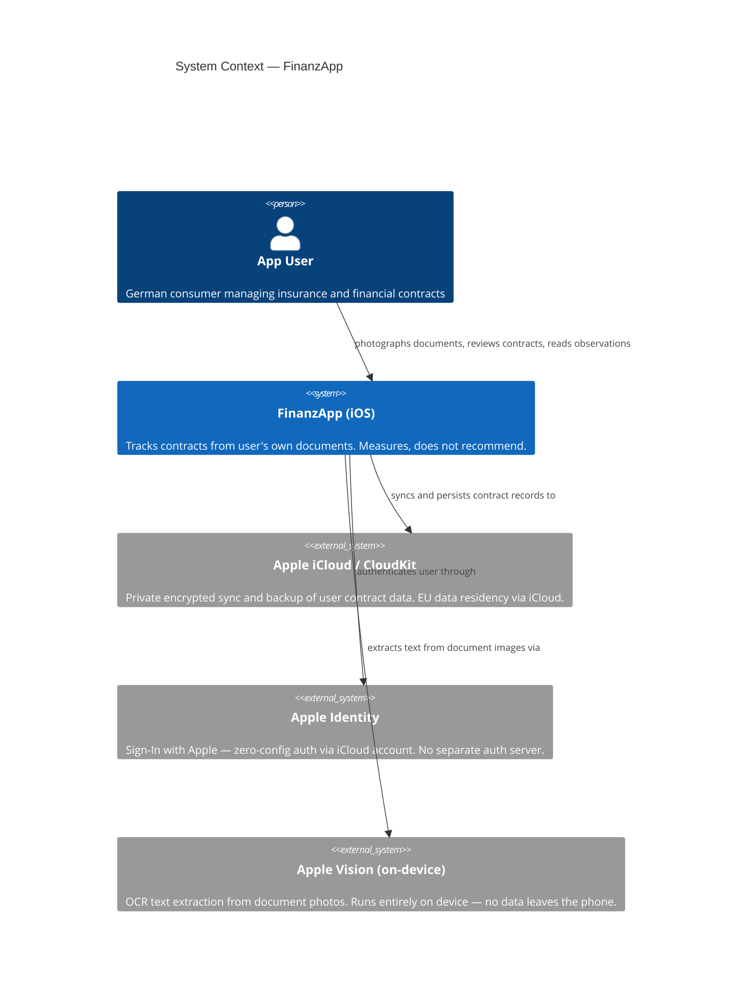
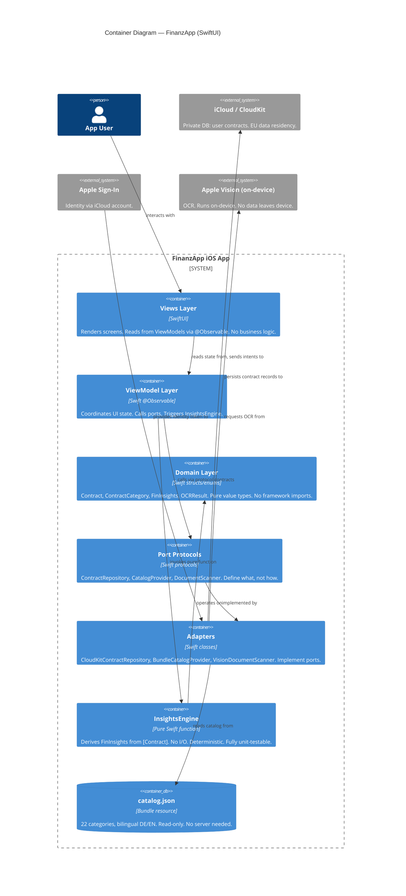
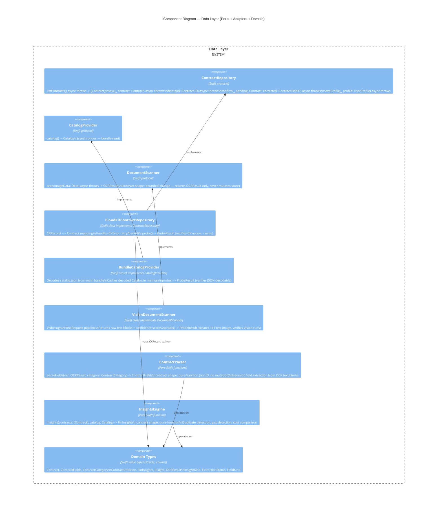
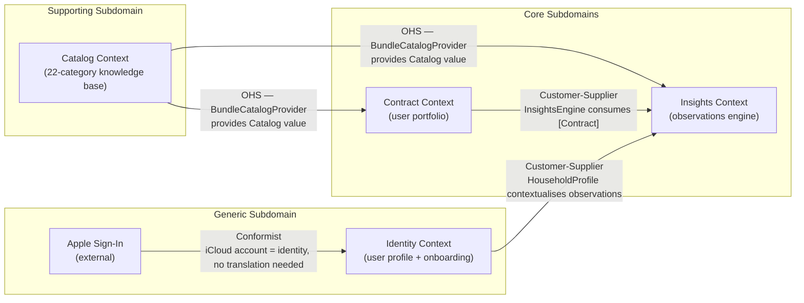

# FinanzApp — Architecture Brief

**Status:** Draft — awaiting option selection  
**Date:** 2026-06-26  
**Architect:** Morgan (nw-solution-architect)  
**Wave:** DESIGN

---

## System Architecture

### System Context

FinanzApp is a native iOS application (SwiftUI) for German B2C users. The system is intentionally narrow: it ingests user-owned documents, extracts structured contract data on-device, stores that data privately via iCloud, and presents deterministic factual observations. No server-side business logic. No recommendation engine. No third-party analytics or ad SDKs.



---

## Application Architecture

### Proposed Architecture Options

This section presents three architecture options for the SwiftUI application layer. The solo-developer constraint and Stage 1 MVP scope are the primary drivers. Options are ranked by simplicity — pick the simplest that meets forward-looking needs.

---

### Option A — MV Pattern (Apple's recommended, simplest)

**What it is:** Views bind directly to `@Observable` model objects. No separate ViewModel layer. Apple's own guidance for SwiftUI since iOS 17 (`@Observable` macro, Observation framework).

**Structure:**
```
FinanzApp/
├── App/
│   └── FinanzAppApp.swift          @main, environment wiring
├── Models/                         @Observable model objects (state + behavior)
│   ├── ContractStore.swift         owns List<Contract>, loads/saves via CloudKit
│   ├── CatalogStore.swift          owns Catalog loaded from bundle JSON
│   └── InsightsEngine.swift        pure function: [Contract] -> FinInsights
├── Views/
│   ├── Dashboard/
│   ├── ContractList/
│   ├── Review/
│   ├── Observations/
│   ├── Compare/
│   ├── KnowledgeHub/
│   └── Settings/
├── Adapters/
│   ├── CloudKitAdapter.swift       CloudKit CKRecord <-> Contract translation
│   └── VisionAdapter.swift         Vision framework -> raw extracted text
├── Catalog/
│   └── catalog.json                bundle resource (unchanged from Flutter)
└── Resources/
    └── Localizable.xcstrings       DE/EN strings
```

**Data flow:**
```
catalog.json (bundle) → CatalogStore (@Observable)
                                ↓
                         Views read catalog
                         
Document photo → VisionAdapter → raw text + bounding boxes
                                ↓
                         OCRResult (plain struct)
                                ↓
                    ContractStore.ingestOCR(_:)    ← pure parsing logic
                                ↓
                    Contract (struct, pending review)
                                ↓
                    User confirms/edits in ReviewView
                                ↓
                    ContractStore.confirm(_:)
                                ↓
                    CloudKitAdapter.save(_:)
                                ↓
                    iCloud Private Database
```

**Trade-offs:**

| Dimension | Assessment |
|-----------|------------|
| Complexity | Lowest — no architecture ceremony |
| Testability | Good — `InsightsEngine` is a pure function; `ContractStore` can be initialized with in-memory data; `VisionAdapter` accepts a protocol |
| SwiftUI alignment | Highest — uses `@Observable` as Apple intended |
| Scalability (team) | Solo dev: perfect. 3+ devs: friction around ContractStore grows |
| Enforceability | `import-linter` (Swift Package Plugin) can enforce Adapters never import Views |

**Risk:** `ContractStore` can accumulate mixed concerns over time without discipline. Mitigated by the `Adapters/` boundary keeping I/O out of models.

---

### Option B — MVVM with Protocol-Typed Stores (classical, widely documented)

**What it is:** Each screen or feature gets a `ViewModel` (`@Observable` class) that owns presentation logic. Stores are protocol-typed so ViewModels can be tested with mock stores. The Flutter codebase's `ContractsController`/`CatalogController` pattern maps almost 1:1 here.

**Structure:**
```
FinanzApp/
├── App/
├── Domain/                         Pure Swift value types (structs, enums)
│   ├── Contract.swift
│   ├── ContractCategory.swift
│   ├── ContractCriterion.swift
│   ├── FinInsights.swift
│   └── OCRResult.swift
├── Ports/                          Swift protocols (dependency inversion)
│   ├── ContractRepository.swift    listContracts / save / delete / confirm
│   ├── CatalogProvider.swift       catalog() -> Catalog
│   └── DocumentScanner.swift       scan(image:) -> OCRResult
├── Adapters/                       Protocol implementations
│   ├── CloudKitContractRepository.swift
│   ├── BundleCatalogProvider.swift
│   └── VisionDocumentScanner.swift
├── ViewModels/
│   ├── DashboardViewModel.swift
│   ├── ContractListViewModel.swift
│   ├── ReviewViewModel.swift
│   ├── ObservationsViewModel.swift
│   ├── CompareViewModel.swift
│   └── SettingsViewModel.swift
├── Views/
│   ├── Dashboard/
│   ├── ContractList/
│   └── ...
└── Services/
    └── InsightsEngine.swift        static func insights(from: [Contract]) -> FinInsights
```

**Data flow:**
```
BundleCatalogProvider (protocol impl) ─── CatalogProvider protocol ───► DashboardViewModel
CloudKitContractRepository (impl) ────── ContractRepository protocol ──► ContractListViewModel
VisionDocumentScanner (impl) ──────────── DocumentScanner protocol ────► ReviewViewModel
                                                    ↓
                                          InsightsEngine.insights(from:)   ← pure function
                                                    ↓
                                          ObservationsViewModel
```

**Trade-offs:**

| Dimension | Assessment |
|-----------|------------|
| Complexity | Medium — protocol ceremony is real but pays off in tests |
| Testability | Highest — every dependency injectable; ViewModels fully unit-testable with mocks |
| SwiftUI alignment | Good — `@Observable` ViewModels work perfectly |
| Flutter parity | High — ContractRepository protocol mirrors existing `ContractsRepository` interface |
| Enforceability | ArchUnit-equivalent via `swiftlint` custom rules + `swift-dependencies` library |

**Risk:** Over-engineering for solo dev — 3 layers where 1 might do for Stage 1. But the port/adapter shape means zero refactor cost when a second developer joins.

---

### Option C — The Composable Architecture (TCA, pointfreeco)

**What it is:** Unidirectional state machine. All state in a single `Store`, mutations via `Action` enums, side effects via `Effect`. Popular in SwiftUI community.

**Trade-offs:**

| Dimension | Assessment |
|-----------|------------|
| Complexity | Highest — significant learning curve, verbose action boilerplate |
| Testability | Excellent — but requires understanding TCA-specific test APIs |
| External dependency | SPM package `swift-composable-architecture` — adds 3rd-party dependency to core architecture |
| Solo dev fit | Poor for Stage 1 — TCA pays off at team of 3+ with complex async flows |
| Time-to-market | Slowest of the three |

**Verdict for this project:** Rejected. Solo developer, Stage 1 MVP with well-understood domain. TCA solves coordination problems that don't exist yet. Reconsidering when team grows to 3+ is appropriate.

---

### Architecture Decision

**Recommendation: Option B (MVVM + Protocol-Typed Ports)**

Rationale:
1. **Testability is non-negotiable** for a financial transparency app — even at Stage 1. OCR parsing, insights calculation, and CloudKit sync all need isolated tests.
2. **Port/adapter shape matches the Flutter codebase exactly.** The existing `ContractsRepository` protocol and `ContractsController` translate with minimal conceptual overhead. Reuse analysis confirms this (see below).
3. **Simplest that is also production-quality.** Option A risks the model becoming a God Object. Option C is over-engineered.
4. **The protocol layer costs ~2 days upfront** and prevents weeks of refactoring later when OCR or CloudKit adapter is swapped.

If after reading this you prefer Option A for faster initial velocity, that is a valid choice — the `Adapters/` boundary in Option A is the seed of Option B and can be grown incrementally.

---

## C4 Container Diagram



---

## C4 Component Diagram — Data Layer



---

## Reuse Analysis — Flutter to Swift

Every Flutter model is assessed for EXTEND (same concepts, translate directly) or CREATE NEW (Swift idioms diverge enough to warrant a clean design).

| Flutter Type | Swift Equivalent | Decision | Notes |
|---|---|---|---|
| `ExtractionResult` | `Contract` | EXTEND (rename) | Split into `Contract` (confirmed) + `PendingContract` (pre-review). `ExtractionStatus` maps to Swift enum with associated values. |
| `FieldAssessment` | `FieldConfidence` | EXTEND | Identical concept. Swift struct. `confidence: Double`, `needsReview: Bool`. |
| `ContractCategory` | `ContractCategory` | EXTEND (direct) | All fields map 1:1. Swift struct. Bilingual `name(for:)` method replacing Dart's global `isEnglish`. |
| `ContractFieldSpec` | `ContractFieldSpec` | EXTEND (direct) | `FieldKind` enum maps identically. `choices: [ContractFieldChoice]` unchanged. |
| `ContractFieldChoice` | `ContractFieldChoice` | EXTEND (direct) | Same structure. |
| `ContractCriterion` | `ContractCriterion` | EXTEND (direct) | Same structure. |
| `KnowledgeArticle` | `KnowledgeArticle` | EXTEND (direct) | Same structure. |
| `Catalog` | `Catalog` | EXTEND (direct) | `byLevel: [Int: [ContractCategory]]` unchanged. Lookup methods unchanged. |
| `FinInsights` | `FinInsights` | EXTEND (rename factory) | `FinInsights.from(_:)` becomes `InsightsEngine.insights(contracts:catalog:)` — extracted to standalone pure function (not a factory method on the type). |
| `Insight` | `Insight` | EXTEND (direct) | `InsightKind`, title, detail, educationLink, articleId all map. `compareType` → `compareCategory: String?`. |
| `ContractsController` | `ContractListViewModel` | EXTEND (restructure) | `ChangeNotifier` → `@Observable`. `listContracts()` async pattern preserved. `reset()` on sign-out preserved. |
| `CatalogController` | `CatalogStore` | EXTEND (simplify) | Without Supabase, `load()` becomes synchronous bundle read. `categoriesByLevel` dict preserved. |
| `ContractsRepository` (interface) | `ContractRepository` (protocol) | EXTEND (translate) | All 5 methods translate. `submitDocument(filePath:)` becomes `scan(imageData:)` on `DocumentScanner` (separate port — document scanning is not the repository's responsibility). |
| `MockContractsRepository` | `MockContractRepository` | EXTEND (direct) | 11 mock contracts translate directly. Used for previews + unit tests. |

**Key structural divergence:** In Flutter, `ExtractionResult` serves double duty as both the in-flight (unconfirmed) and confirmed contract type — the `status` field distinguishes them. In Swift, model this as:

```
PendingContract          — OCR output awaiting user review
    ↓ user confirms
Contract                 — confirmed, stored in CloudKit
```

This eliminates the `ExtractionStatus.needsReview` runtime branch and makes the state machine structurally impossible to misuse (a UI that shows "confirmed" contracts can only receive `Contract`, never `PendingContract`).

---

## Technology Stack

| Component | Technology | License | Rationale |
|---|---|---|---|
| UI framework | SwiftUI (Apple) | Proprietary (platform) | Decided. iOS-native, no alternative considered. |
| State management | Swift Observation (`@Observable`) | MIT (stdlib) | Apple's recommended approach since iOS 17. No 3rd-party dependency. |
| Sync / persistence | CloudKit (Apple) | Proprietary (platform) | Decided. EU data residency via iCloud, zero auth server cost. |
| Authentication | Sign In with Apple | Proprietary (platform) | Decided. Zero-config, mandatory for App Store apps offering social login. |
| OCR | Apple Vision (VNRecognizeTextRequest) | Proprietary (platform) | Decided. On-device, no data egress, free. |
| Catalog data | catalog.json (bundle) | — | Decided. Unchanged from Flutter reference. |
| Localization | Xcstrings (Apple) | MIT (platform) | Native DE/EN switching without 3rd-party library. |
| Dependency management | Swift Package Manager | MIT (platform) | No 3rd-party dep manager needed. |
| Linting | SwiftLint | MIT (github.com/realm/SwiftLint) | Custom rules enforce layer boundaries. |
| Testing | Swift Testing (Apple, iOS 18+) + XCTest | MIT (platform) | `InsightsEngine` and `ContractParser` fully unit-testable as pure functions. |

**No 3rd-party architecture framework** (no TCA, no Combine wrappers). The domain is simple enough that `@Observable` + protocol injection is sufficient.

---

## Quality Attribute Strategies

### Security and Privacy
- CloudKit Private Database: encrypted in transit and at rest, visible only to the authenticated iCloud account. Apple manages keys.
- Sign In with Apple: no email shared by default. No password stored by FinanzApp.
- On-device OCR: document images never leave the device.
- No analytics SDK, no crash reporter that exfiltrates data to non-EU servers.
- Screenshot protection on the contract detail and observations screens (UIKit `UITextField.isSecureTextEntry` equivalent for SwiftUI via `.privacySensitive()`).
- EU data residency satisfied by iCloud (Apple's EU Data Protection Agreement).

### Reliability and Offline
- `catalog.json` bundled — app fully functional offline for viewing existing contracts and reading knowledge articles.
- CloudKit sync is opportunistic: app reads from local CloudKit cache, syncs when connectivity available.
- `ContractRepository.listContracts()` returns cached local data immediately; background sync updates via CloudKit push notifications.

### Testability (enforced, not assumed)
- `InsightsEngine.insights(contracts:catalog:)` — pure function. 100% unit-testable with zero mocking.
- `ContractParser.parseFields(ocr:category:)` — pure function. OCR heuristics tested with fixture text blocks.
- `ContractRepository`, `CatalogProvider`, `DocumentScanner` are protocol-typed — all ViewModels accept mock implementations in tests.
- `MockContractRepository` ships in the test target (and SwiftUI Previews) with the same 11-contract fixture as the Flutter mock.

### Maintainability
- Dependency rule: Domain types have zero imports beyond Foundation. Ports import Domain only. Adapters import Ports + frameworks. ViewModels import Ports + Domain. Views import ViewModels + Domain.
- SwiftLint custom rule enforces the above: `import` of `CloudKit` or `Vision` in `Domain/` or `Ports/` is a build error.
- Catalog JSON schema version checked at startup (`schemaVersion` field) — app surfaces a degraded-mode warning if bundle schema doesn't match expected version.

### Performance
- `InsightsEngine` runs on background queue via Swift `async`/`await`; result delivered to main actor for UI update. 11 contracts: sub-millisecond. 100 contracts: still sub-10ms (pure computation).
- Vision OCR: long-running, runs on background thread. Progress reported via `@Observable` `scanProgress: Double` on the ReviewViewModel.
- CloudKit fetch: paginated with `CKQueryOperation.resultsLimit = 100` (sufficient for expected user portfolio size of 10–30 contracts).

---

## Navigation Architecture

SwiftUI `NavigationStack` with typed routes. Tab bar for top-level destinations.

```
TabView
├── Tab: Übersicht (Dashboard)
├── Tab: Verträge (ContractList)
│   └── NavigationStack
│       ├── ContractListView
│       ├── ReviewView (pending contract)
│       ├── ContractDetailView (confirmed contract)
│       └── CompareView (contractType: String)
├── Tab: Beobachtungen (Observations)
│   └── NavigationStack
│       └── ObservationsView
│           └── KnowledgeArticleView
└── Tab: Mehr (Settings / Knowledge Hub)
    └── NavigationStack
        ├── SettingsView
        └── KnowledgeHubView
            └── KnowledgeArticleView
```

Onboarding is presented as a `.fullScreenCover` over the TabView on first launch (determined by absence of a CloudKit `UserProfile` record).

Upload/scan is accessible from `ContractListView` as a `+` toolbar button, presenting a sheet.

---

## Architectural Enforcement

**Tool:** SwiftLint with custom rules (`swiftlint.yml`)

Rules to enforce:
1. `no_cloudkit_in_domain` — Files in `Domain/` must not `import CloudKit`
2. `no_vision_in_domain` — Files in `Domain/` must not `import Vision`
3. `no_uikit_in_viewmodels` — ViewModels must not `import UIKit` (UI concerns belong in Views)
4. `no_domain_writes_in_ports` — Port protocols must only declare `async throws` functions (side effects declared, not hidden)
5. `viewmodel_uses_protocol` — ViewModels must reference `ContractRepository`, `CatalogProvider`, `DocumentScanner` by protocol type, not concrete type

**Probe contract enforcement** (Earned Trust, Principle 13):
- `CloudKitContractRepository.probe()` — verifies CloudKit container accessibility + write permission before first use. Called at app startup from `@main` before ViewModels are created.
- `BundleCatalogProvider.probe()` — verifies `catalog.json` is decodable and schema version matches. Called synchronously at app startup.
- `VisionDocumentScanner.probe()` — creates a 1×1 white image, runs `VNRecognizeTextRequest`, verifies no crash (Vision availability check). Called lazily before first scan.
- Composition root invariant: all probes run in `AppDelegate.application(_:didFinishLaunchingWithOptions:)` before root view is shown. A failed probe shows a `ProbeFailureView` with a structured error rather than crashing silently.

---

## Effect Isolation (Principle 12 — Contract Shape Classification)

| Component | Contract Shape | Assertion Mechanism |
|---|---|---|
| `InsightsEngine.insights(contracts:catalog:)` | Pure function — returns `FinInsights`, no I/O | XCTest: call with fixture, assert output. No mocking needed. |
| `ContractParser.parseFields(ocr:category:)` | Pure function — returns `ContractFields`, no I/O | XCTest with fixture OCR text blocks. |
| `VisionDocumentScanner.scan(imageData:)` | Bounded-change — declared mutation: none. Returns `OCRResult` only. | Protocol boundary prevents adding mutation. `DocumentScanner` protocol has no mutating methods. |
| `CloudKitContractRepository.save(_:)` | Unbounded-preservation — CloudKit write. | `probe()` verifies write access. Integration test uses `CKContainer` test environment. |
| `ContractListViewModel` | Bounded-change — mutates own `@Observable` state only. Universe: `[Contract]`, `isLoading`, `error`. | Unit test with `MockContractRepository`. Assert only observable properties change. |
| `BundleCatalogProvider.catalog()` | Pure function (after first load) — synchronous, returns cached `Catalog`. | XCTest: call twice, assert same reference. |

**Plan-value pattern for OCR review:**
The scan flow returns an `OCRResult` (plan-value) — a plain struct of text blocks with confidence scores. `ContractParser.parseFields(ocr:category:)` derives a `ContractFields` struct (another plan-value). The user reviews this in `ReviewView`. Only when the user confirms does `CloudKitContractRepository.save(_:)` execute the side effect. The bug class "document scanned silently wrote to CloudKit" is structurally impossible.

---

## External Integrations

All integrations are Apple platform services. No third-party REST APIs in Stage 1.

| Service | Integration Type | Risk | Contract Test Note |
|---|---|---|---|
| iCloud / CloudKit | Apple SDK (CloudKit framework) | Medium — CloudKit errors are well-documented; `probe()` catches availability issues | No consumer-driven contract test applicable — Apple SDK. Probe covers behavioral verification. |
| Apple Vision | Apple SDK (Vision framework) | Low — stable API since iOS 13 | Probe test with 1×1 image. |
| Sign In with Apple | Apple SDK (AuthenticationServices) | Low — mandatory App Store API | Manual smoke test on device sufficient. |

No external REST APIs at Stage 1. Contract testing annotation for platform-architect: not applicable for Stage 1. If Stage 3 introduces broker referral APIs, consumer-driven contracts (Pact or equivalent) should be added at that boundary.

---

## Open Questions (for user decision)

1. **Architecture option selection:** A (MV, simplest), B (MVVM+Protocols, recommended), or C (TCA, rejected but documented)?
2. **CloudKit record type naming:** Use `Contract` as the CKRecord type key, or mirror catalog `key` strings (e.g., `privathaftpflicht`)? ADR-002 covers this.
3. **OCR field extraction strategy:** Pure heuristics (regex on OCR text) vs. on-device ML model vs. future server-side LLM? ADR-003 (not yet written — needs direction).
4. **Pending contracts storage:** Store `PendingContract` in CloudKit (synced across devices) or only in local app state (lost on app restart)? Recommendation: local only for Stage 1 — simpler, no partial-state sync issues.


---

## Architecture Decisions (User-confirmed 2026-06-26)

| # | Decision | Choice | Rationale |
|---|----------|--------|-----------|
| D1 | Application architecture | **Option B — MVVM + Protocol-Typed Ports** | Testability, clean port/adapter separation, 1:1 Flutter mapping |
| D2 | PendingContract storage | **CloudKit (synced)** | User wants pending OCR results available across device restarts and future multi-device |
| D3 | OCR field extraction | Heuristic (Phase 1) → open for LLM later | Keeps Stage 1 simple; port boundary (`DocumentScanner`) allows future swap |
| D4 | CloudKit record type key | `Contract` (not category key) | Stable across catalog evolution; category stored as `contractType` field |

---

## CloudKit Infrastructure

**Owner:** `CloudKitContractRepository` (implements `ContractRepository` protocol)  
**Full specification:** ADR-002 (data model), ADR-003 (sync strategy)

### Zone Topology

```
iCloud Private Database
└── FinanzAppZone (CKRecordZone, custom)
    ├── Contract records       (confirmed contracts, 10–30 per user)
    ├── PendingContract records (OCR-extracted, awaiting review)
    └── UserProfile record     (fixed recordName: "userprofile", singleton)
```

Single custom zone. Custom zone is required for `CKFetchRecordZoneChangesOperation` (delta sync with server change token). All three record types colocated — no cross-zone references.

### CKRecord Schema Summary

**`Contract`** — confirmed contract

| Field | CK Type | Notes |
|---|---|---|
| `categoryKey` | String | `catalog.json` key, e.g. `"privathaftpflicht"`. Queryable index. |
| `provider` | String | Required on confirmation. |
| `contractNumber` | String? | Optional. |
| `startDate` | Date? | |
| `endDate` | Date? | |
| `premiumAmount` | Double? | EUR. Top-level for client-side aggregation. Sortable index. |
| `premiumInterval` | String? | One of: `"monatlich"`, `"vierteljaehrlich"`, `"halbjaehrlich"`, `"jaehrlich"`, `"einmalig"`. |
| `fieldsJSON` | String | All category-specific fields as JSON. Zero schema churn when catalog fields are added. |
| `criteriaJSON` | String? | Criterion key → Bool map as JSON. Nil if category has no criteria. |
| `schemaVersion` | String | `"1.0"`. Enables `ContractMigrator` on schema change. |

Record ID: `CKRecord.ID(recordName: contract.id.uuidString, zoneID: FinanzAppZone)` — UUID is stable across saves; enables upsert semantics.

**`PendingContract`** — OCR output awaiting user review

All `Contract` fields (nullable) plus:

| Field | CK Type | Notes |
|---|---|---|
| `rawOCRText` | String | Full VNRecognizeTextRequest output. ~3–20 KB. String (not CKAsset) — well under 1 MB CKRecord limit. |
| `ocrConfidence` | Double | Mean confidence across all text observations. 0.0–1.0. |
| `extractedAt` | Date | Timestamp of OCR completion. Sortable index. Used for 30-day orphan TTL. |

**`UserProfile`** — singleton onboarding record

| Field | CK Type | Notes |
|---|---|---|
| `onboardingComplete` | Int64 | `1` = onboarding finished. Checked every launch. |
| `languagePreference` | String? | `"de"` / `"en"`. Nil = follow system locale. |
| `householdSize` | Int64? | Onboarding answer. |
| `hasPartner` | Int64? | 0/1 (no native Bool in CloudKit). |
| `hasChildren` | Int64? | 0/1. |
| `schemaVersion` | String | `"1.0"`. |

### Sync Strategy

```
Launch → probe() → CKFetchRecordZoneChangesOperation (delta via serverChangeToken)
                                              ↓
                                   Update in-memory + UserDefaults cache
                                              ↓
                            CKDatabaseSubscription (APNs silent push)
                                              ↓
                               Any device-side change → background delta fetch
```

**Token storage:** `UserDefaults` key `"FinanzApp.serverChangeToken"` (NSKeyedArchiver encoded). Nil on first launch → full fetch baseline.

**Offline reads:** `UserDefaults` JSON cache (`"FinanzApp.localContractCache"`) — contracts available immediately with no network.

**Save policy:** `CKModifyRecordsOperation.savePolicy = .changedKeys` — sends only modified fields; reduces bandwidth and conflict surface.

### PendingContract Lifecycle

```
OCR complete → savePending() → [user reviews] → confirm(): delete pending + save Contract (atomic)
                                              → discard(): delete pending
Orphan cleanup: PendingContracts older than 30 days deleted on launch.
```

Confirm is a single `CKModifyRecordsOperation` with both the deletion of the `PendingContract` record and the save of the `Contract` record. Atomic on custom zone — no partial states.

### Error Handling Summary

| CKError | Disposition |
|---|---|
| `.networkUnavailable`, `.networkFailure` | Return cache; offline banner; retry on connectivity restore |
| `.serviceUnavailable`, `.requestRateLimited` | Exponential backoff; use `CKErrorRetryAfterKey` if present |
| `.changeTokenExpired` | Reset token; full fetch |
| `.userDeletedZone`, `.zoneNotFound` | Recreate zone; re-upload from cache |
| `.unknownItem` | Treat as absent (idempotent) |
| `.serverRecordChanged` | LWW by `modificationDate`; user prompt if < 60s delta |
| `.quotaExceeded` | Non-retryable; full-screen user prompt |
| `.notAuthenticated`, `.permissionFailure` | Prompt user to sign in to iCloud |
| `.serverResponseLost` | Fetch by recordID to verify state before retry |

Full error matrix: ADR-003 Section 4.

### Probe Contract (Substrate Verification)

`CloudKitContractRepository.probe()` runs at app startup before ViewModels initialize. Steps:

1. Verify `CKContainer.accountStatus() == .available`
2. Create `FinanzAppZone` (idempotent `CKModifyRecordZonesOperation`)
3. Write a canary `Contract` record (`recordName: "probe-canary"`) and read it back — verifies actual write + read access, not just API availability
4. Delete canary record
5. Register `CKDatabaseSubscription` (idempotent)

A failed probe emits `health.startup.refused` via `os.Logger` and presents `ProbeFailureView` instead of the tab interface. The app refuses to start rather than operating with an unverified persistence substrate.

### Back-of-Envelope

| Metric | Value | Notes |
|---|---|---|
| Records per user | 10–30 contracts + 0–5 pending + 1 profile | Order of magnitude |
| Bytes per Contract record | ~2 KB | fieldsJSON ~1 KB + fixed fields ~300 B + overhead |
| Bytes per PendingContract | ~5–22 KB | rawOCRText dominates at ~3–20 KB |
| Total storage per user | ~100 KB | Well within iCloud free tier (5 GB) |
| Delta sync payload | 0–5 records, ~10 KB | Typical daily delta for single active device |
| CloudKit API calls per launch | ~5 | probe canary (3) + subscription registration (1) + zone change fetch (1) |
| `CKFetchRecordZoneChangesOperation` latency | ~200–500 ms | On good mobile connection, EU data centre |

---

## Domain Model

**Authored by:** Hera (nw-ddd-architect)
**Date:** 2026-06-26
**Scope:** Stage 1 — "messen, nicht empfehlen"

---

### Subdomain Classification

| Subdomain | Type | Rationale |
|---|---|---|
| Contract Tracking | **Core** | The unique differentiator. No competitor offers pure transparency without upsell. The OCR-ingest-to-observation pipeline is FinanzApp's identity. |
| Insights / Observations | **Core** | Deterministic measurement engine (duplicate detection, gap detection, coverage score). This is what users experience as value. |
| Catalog Knowledge | **Supporting** | Enables the core, but the 22-category schema is domain knowledge, not competitive code. Changes infrequently. |
| Identity / Onboarding | **Generic** | Apple provides auth. User profile (household size, language preference) is configuration, not differentiation. |

---

### Bounded Contexts

#### Context 1: Catalog Context

**Role:** Upstream, read-only knowledge base.

The catalog is the structured reference of what financial contracts exist in Germany: 22 categories, their field schemas, evaluation criteria, and knowledge articles. It is curated knowledge, not user data. It changes only when FinanzApp adds or revises categories — not when users add contracts.

**Ubiquitous language (this context):** Category, Criterion, FieldSpec, NeedsLevel, KnowledgeArticle.

**Word divergence note:** "Category" here means a type of insurance or financial product in the German market (e.g. `privathaftpflicht`). In the Contract Context, the same word would be the user's assigned category for a specific contract. These are the same concept — no boundary split needed — but "Category" as a knowledge artifact lives here.

**Subdomain:** Supporting.

---

#### Context 2: Contract Context

**Role:** Core. Owns the user's financial contract portfolio.

This is where user data lives. A contract enters as a `PendingContract` (OCR output awaiting user review) and transitions to `Contract` (confirmed, stored in CloudKit) via an explicit user action. The transition is a state machine encoded in types — not a status flag.

**Ubiquitous language (this context):** PendingContract, Contract, ContractFields, FieldConfidence, Premium, ContractCategory (referenced by key), OCRResult, DocumentScan.

**Word divergence note:** "Premium" in a Kfz-Versicherung context means the periodic payment. In a Depot context, the same field is a savings rate (`Sparrate`). In the domain model, both are represented as `Premium(amount: Money, interval: PremiumInterval)` — the label in the UI uses the catalog's localized field label (`Beitrag` vs. `Sparrate`) but the domain type is unified.

**Subdomain:** Core.

---

#### Context 3: Insights Context

**Role:** Core. Derives factual observations from confirmed contracts against the catalog.

This context is a pure function: `[Contract] + Catalog → FinInsights`. It has no storage, no mutation, no identity. It cannot modify contracts. Its output — observations about duplicates, coverage gaps, and measurable facts — is derived on demand and never persisted (Stage 1).

**Ubiquitous language (this context):** Beobachtung (Observation), Messung (Measurement), DuplicateObservation, CoverageGapObservation, ComparisonObservation, CoverageScore, MonthlySpend.

**Word divergence note:** The word "Empfehlung" (recommendation) is **banned** from this context's language. Any statement from this context is a `Beobachtung` — a factual observation derived from data. This is not a naming convention; it is a domain invariant.

**Subdomain:** Core.

---

#### Context 4: Identity Context

**Role:** Generic. User profile and onboarding state.

Stores household configuration (size, partner, children) and language preference. This data contextualizes insights (e.g. household size affects which catalog level-1 categories are relevant) but the Identity Context does not compute anything. It is configuration data passed as input to the Insights Context.

**Ubiquitous language (this context):** UserProfile, HouseholdSize, LanguagePreference, OnboardingState.

**Subdomain:** Generic. Apple Sign-In handles authentication. Identity Context = user preferences only.

---

### Context Map



**Relationship notes:**

- **Catalog → Contract (OHS):** The Catalog provides an Open Host Service via `BundleCatalogProvider`. The Contract Context uses it to validate category keys and resolve field schemas. It conforms to Catalog's model — category keys like `"privathaftpflicht"` flow into `Contract.categoryKey` unchanged.
- **Catalog → Insights (OHS):** Insights needs the catalog to know which level-1 categories exist for gap detection. Same provider, same conformist relationship.
- **Contract → Insights (Customer-Supplier):** Insights is the downstream consumer. `InsightsEngine.insights(contracts:catalog:)` takes a `[Contract]` snapshot. The Contract Context defines what a confirmed contract looks like; Insights conforms to that shape. No ACL needed — Contract's model is clean.
- **Identity → Insights (Customer-Supplier):** `HouseholdProfile` is passed to `InsightsEngine` to contextualize which gaps matter (e.g. `risikolebensversicherung` is only a gap for users with dependants). Stage 1 may not fully implement this; the port is designed to accept it.
- **Apple → Identity (Conformist):** The Identity Context adopts Apple's identity model as-is. The iCloud account IS the user. No translation layer needed.

---

### Aggregates

This app is a solo-developer Stage 1 product. Aggregates are small by design. The primary consistency question for each aggregate is: what must be atomically true?

---

#### Aggregate: Contract

**Context:** Contract Context
**Aggregate root:** `Contract`
**Vernon rules satisfied:**
- Rule 1 (true invariants): A Contract must always have a valid `categoryKey` (resolvable in Catalog), a non-empty `provider`, and either a `premiumAmount` or a `nil` (not a zero). These three properties must be consistent in the same write.
- Rule 2 (small): Root entity only. `ContractFields` is a value object bag, not a child entity. No collection of line items.
- Rule 3 (external refs by ID): References `ContractCategory` by `categoryKey: String`, never by object reference. `UserProfile` referenced by the implicit iCloud account scope — no explicit ID in the aggregate.
- Rule 4 (eventual consistency outside): The transition from `PendingContract` to `Contract` is surfaced as a domain event `ContractConfirmed`. Other contexts (Insights) react to the confirmed snapshot, not to a direct object reference.

**Full observable state (`snapshot_aggregate()`):**

```swift
struct Contract {
    var id: UUID                          // stable, assigned at PendingContract creation
    var categoryKey: String               // catalog key, e.g. "privathaftpflicht"
    var provider: String                  // required, non-empty
    var contractNumber: String?
    var startDate: Date?
    var endDate: Date?
    var premium: Premium?                 // value object: amount + interval
    var fields: ContractFields            // value object: [String: FieldValue]
    var criteria: [String: Bool]          // criterion key → met/not-met (optional)
    var confirmedAt: Date                 // timestamp of user confirmation
    var schemaVersion: String             // "1.0"
}
```

**Command: ConfirmPendingContract**
- Declared delta: `id` (copied from PendingContract), `categoryKey`, `provider`, `premium`, `fields`, `criteria`, `confirmedAt` (set to now), `schemaVersion`
- Events appended: `ContractConfirmed`
- Complement (what must NOT change): nothing else in the CloudKit zone's `Contract` record type is touched. The `PendingContract` record with the same UUID is deleted atomically.

**Command: EditContract**
- Declared delta: any subset of `provider`, `contractNumber`, `startDate`, `endDate`, `premium`, `fields`, `criteria`
- Events appended: `ContractEdited`
- Complement: `id`, `categoryKey`, `confirmedAt`, `schemaVersion` must NOT change.

**Command: DeleteContract**
- Declared delta: record deleted from CloudKit zone
- Events appended: `ContractDeleted`
- Complement: all other `Contract` records in the zone unchanged.

**Aggregate invariant (complement equality):** `after.without(declared_delta) == before.without(declared_delta)`. Concretely: an `EditContract` command may not silently change `categoryKey` or `confirmedAt`. A `ConfirmPendingContract` command may not partially write (CloudKit custom zone atomicity guarantees this at the persistence level).

---

#### Aggregate: PendingContract

**Context:** Contract Context
**Aggregate root:** `PendingContract`
**Vernon rules satisfied:**
- Rule 1: A PendingContract must always carry its `rawOCRText` (the basis for any extracted field), a non-nil `extractedAt`, and a `categoryKey` (may be a user-selected correction, not necessarily OCR-derived).
- Rule 2 (small): Single struct. `ContractFields` is a value object carrying extracted field values with per-field confidence.
- Rule 3: Same `id` UUID as the future `Contract` it will become. No object reference to `Contract`.
- Rule 4: When confirmed, raises `ContractConfirmed` — `Contract` aggregate is created in the same CloudKit operation, but conceptually these are two separate aggregates with a transition domain event.

**Full observable state:**

```swift
struct PendingContract {
    var id: UUID
    var categoryKey: String               // may be nil if OCR failed to classify
    var rawOCRText: String
    var ocrConfidence: Double             // 0.0–1.0
    var extractedAt: Date
    var extractedFields: ContractFields   // value object with per-field confidence
    var fieldConfidences: [String: FieldConfidence]
    var schemaVersion: String
}
```

**Command: CreatePendingContract** (from OCR result)
- Declared delta: all fields set from `OCRResult + ContractParser output`
- Events appended: `PendingContractCreated`
- Complement: no existing `PendingContract` or `Contract` records modified.

**Command: UpdatePendingContractFields** (user edits during review)
- Declared delta: `extractedFields`, `categoryKey` (user may reclassify)
- Events appended: `PendingContractFieldsCorrected`
- Complement: `id`, `rawOCRText`, `ocrConfidence`, `extractedAt` must NOT change. OCR evidence is preserved.

**Orphan invariant:** PendingContracts older than 30 days are removed on launch (enforced by `ContractRepository.deleteOrphanedPending(olderThan:)`). This is a repository-level cleanup, not an aggregate command.

---

#### Aggregate: UserProfile

**Context:** Identity Context
**Aggregate root:** `UserProfile`
**Vernon rules satisfied:**
- Rule 1: Profile must have `onboardingComplete: Bool`. All other fields optional. No cross-field invariants.
- Rule 2 (small): Singleton flat struct.
- Rule 3: No external aggregate references.
- Rule 4: Language preference changes do not trigger other aggregates transactionally. Views react to the `@Observable` state change.

**Full observable state:**

```swift
struct UserProfile {
    var onboardingComplete: Bool
    var languagePreference: LanguagePreference  // .system | .de | .en
    var householdSize: Int?
    var hasPartner: Bool?
    var hasChildren: Bool?
    var schemaVersion: String
}
```

**Command: CompleteOnboarding**
- Declared delta: `onboardingComplete = true`, `householdSize`, `hasPartner`, `hasChildren`, `languagePreference`
- Events appended: `OnboardingCompleted`
- Complement: `schemaVersion` must NOT change.

**Command: UpdateLanguagePreference**
- Declared delta: `languagePreference`
- Events appended: *(none — UI state only; CloudKit save is the side effect)*
- Complement: all other profile fields unchanged.

---

### Value Objects

| Value Object | Fields | Invariant | Notes |
|---|---|---|---|
| `Premium` | `amount: Money`, `interval: PremiumInterval` | Amount must be > 0 if present. Interval must be a valid enum case. | `PremiumInterval`: `.monthly`, `.quarterly`, `.semiannual`, `.annual`, `.oneOff` |
| `Money` | `amount: Decimal`, `currency: Currency` | Amount ≥ 0. Currency is always `.eur` in Stage 1. | Use `Decimal` not `Double` to avoid float rounding in insurance amounts. |
| `ContractFields` | `[String: FieldValue]` | Keys must be valid `ContractFieldSpec.fieldKey` values for the contract's category. | `FieldValue` is an enum: `.text(String)`, `.date(Date)`, `.money(Money)`, `.number(Int)`, `.boolean(Bool)`, `.choice(String)` |
| `FieldConfidence` | `confidence: Double`, `needsReview: Bool` | `confidence` in 0.0–1.0. | Companion to `ContractFields` during review. Discarded after `ContractConfirmed`. |
| `OCRResult` | `textBlocks: [TextBlock]`, `meanConfidence: Double`, `capturedAt: Date` | Non-empty `textBlocks`. | `TextBlock`: `text: String`, `confidence: Double`, `boundingBox: CGRect?` |
| `CategoryKey` | `rawValue: String` | Non-empty, must match a key in `Catalog.categories`. | Strong typedef over String — prevents raw string errors at compile time. |
| `LanguagePreference` | enum | `.system`, `.de`, `.en` | Drives `Locale` selection in Views. |

---

### Domain Events

All events are in-process only (Stage 1 — single app, no distributed consumers). They serve as audit anchors and as the mechanism by which aggregates declare their declared-delta contracts.

| Event | Raised by | Key payload |
|---|---|---|
| `PendingContractCreated` | `CreatePendingContract` command | `id`, `categoryKey`, `extractedAt`, `ocrConfidence` |
| `PendingContractFieldsCorrected` | `UpdatePendingContractFields` command | `id`, changed field keys |
| `ContractConfirmed` | `ConfirmPendingContract` command | `id`, `categoryKey`, `provider`, `confirmedAt` |
| `ContractEdited` | `EditContract` command | `id`, changed field keys |
| `ContractDeleted` | `DeleteContract` command | `id`, `categoryKey` |
| `OnboardingCompleted` | `CompleteOnboarding` command | `householdSize`, `hasPartner`, `hasChildren` |

**Note on Insights:** `FinInsights` is derived on-demand from `[Contract]`. No event is raised when insights change — they are always recomputed. This is intentional: insights have no independent lifecycle or storage in Stage 1.

---

### ES/CQRS Assessment

**Event Sourcing: Not recommended for Stage 1.**

Rationale:
- The domain has two aggregates with simple lifecycle (PendingContract → Contract → deleted). There is no temporal query need ("what was the contract state at time T?").
- CloudKit's CKRecord with `modificationDate` satisfies the implicit audit need (who changed what, when).
- The user base is one person per iCloud account. There is no concurrency conflict surface that would benefit from ES optimistic locking.
- Learning curve and event versioning overhead are not justified for a solo-developer Stage 1 product.

**CQRS: Lightweight read-side separation is already present and sufficient.**

`InsightsEngine.insights(contracts:catalog:)` is a pure read-side projection. It does not share a write model. This is the functional equivalent of CQRS's read-side without the operational overhead of separate stores. No additional CQRS infrastructure is recommended.

**Revisit trigger:** If Stage 3 introduces multi-household or advisor-facing views that need independent read models, or if audit trail requirements emerge from legal review, re-evaluate ES for the Contract Context specifically.
